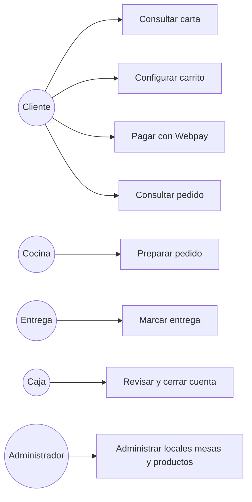
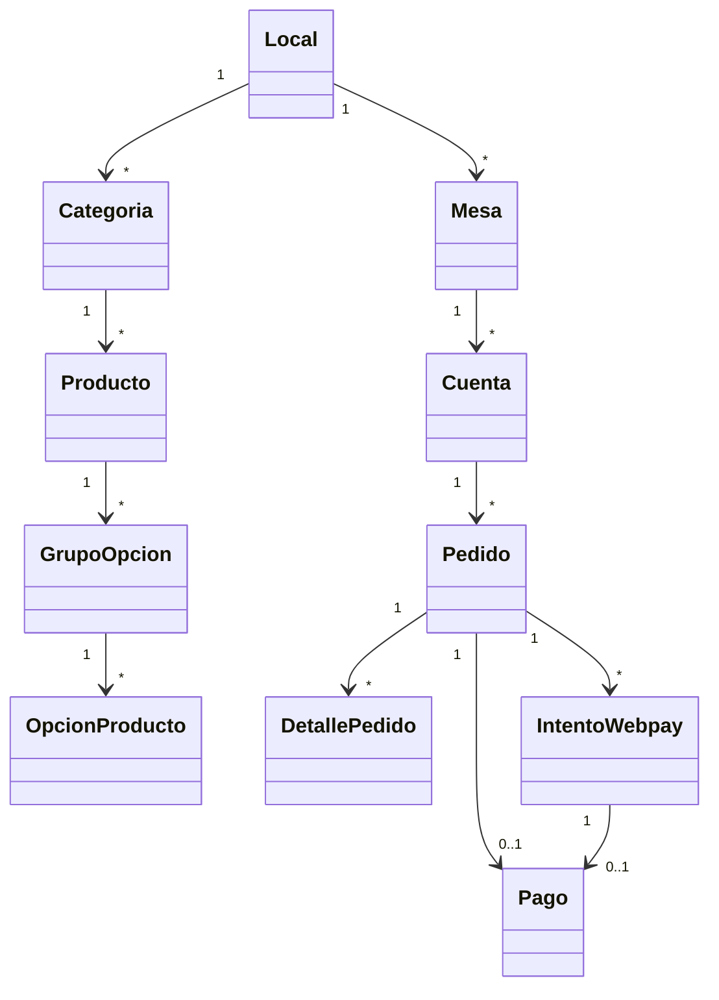
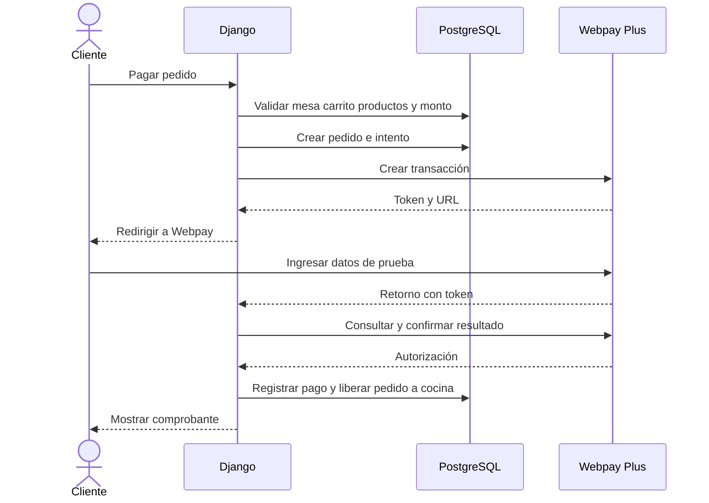
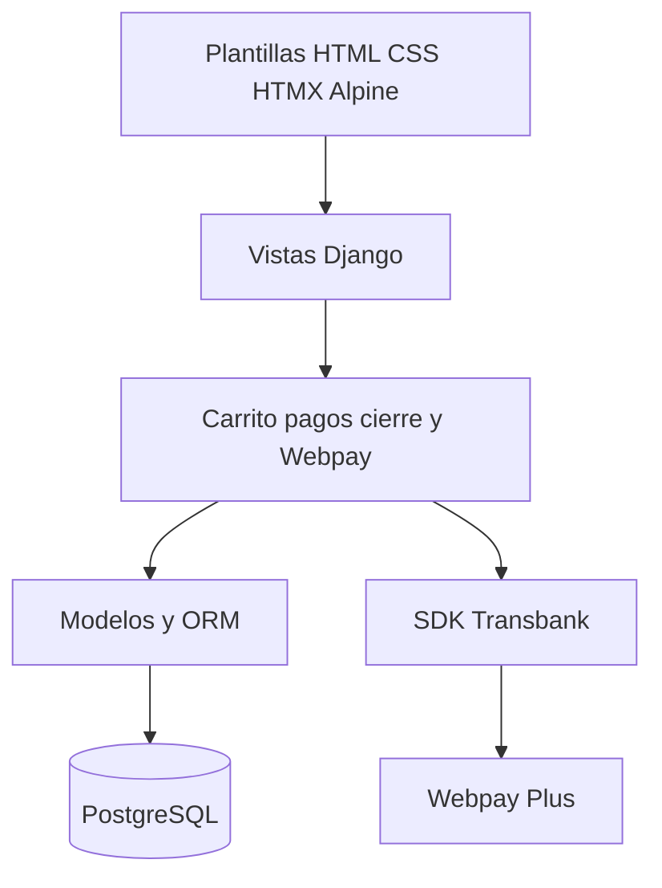

# Diagramas UML de Kippu

## Casos de uso

```mermaid
flowchart LR
    Cliente((Cliente)) --> UC1[Consultar carta]
    Cliente --> UC2[Configurar carrito]
    Cliente --> UC3[Pagar con Webpay]
    Cliente --> UC4[Consultar pedido]
    Cocina((Cocina)) --> UC5[Preparar pedido]
    Entrega((Entrega)) --> UC6[Marcar entrega]
    Caja((Caja)) --> UC7[Revisar y cerrar cuenta]
    Admin((Administrador)) --> UC8[Administrar locales mesas y productos]
```

## Clases de dominio

```mermaid
classDiagram
    class Local
    class Mesa
    class Categoria
    class Producto
    class GrupoOpcion
    class OpcionProducto
    class Cuenta
    class Pedido
    class DetallePedido
    class IntentoWebpay
    class Pago
    Local "1" --> "*" Mesa
    Local "1" --> "*" Categoria
    Categoria "1" --> "*" Producto
    Producto "1" --> "*" GrupoOpcion
    GrupoOpcion "1" --> "*" OpcionProducto
    Mesa "1" --> "*" Cuenta
    Cuenta "1" --> "*" Pedido
    Pedido "1" --> "*" DetallePedido
    Pedido "1" --> "*" IntentoWebpay
    Pedido "1" --> "0..1" Pago
    IntentoWebpay "1" --> "0..1" Pago
```

## Secuencia principal de pago

```mermaid
sequenceDiagram
    actor Cliente
    participant Web as Django
    participant DB as PostgreSQL
    participant TBK as Webpay Plus
    Cliente->>Web: Pagar pedido
    Web->>DB: Validar mesa carrito productos y monto
    Web->>DB: Crear pedido e intento
    Web->>TBK: Crear transacción
    TBK-->>Web: Token y URL
    Web-->>Cliente: Redirigir a Webpay
    Cliente->>TBK: Ingresar datos de prueba
    TBK-->>Web: Retorno con token
    Web->>TBK: Consultar y confirmar resultado
    TBK-->>Web: Autorización
    Web->>DB: Registrar pago y liberar pedido a cocina
    Web-->>Cliente: Mostrar comprobante
```

## Componentes

```mermaid
flowchart TB
    UI[Plantillas HTML CSS HTMX Alpine] --> Views[Vistas Django]
    Views --> Services[Carrito pagos cierre y Webpay]
    Services --> ORM[Modelos y ORM]
    ORM --> PG[(PostgreSQL)]
    Services --> SDK[SDK Transbank]
    SDK --> TBK[Webpay Plus]
```
